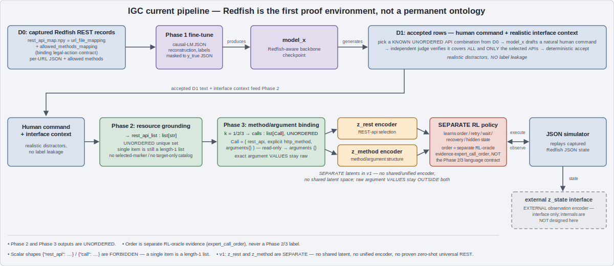

# IGC architecture

This is the authoritative architecture document for `igc`. It describes the **locked current
pipeline** — what the system is, stage by stage — not a roadmap. The machine-readable schema under
`configs/contracts/*.yaml` (the contract files the phase builders and gates load) is the authority
for every data shape; every JSON example in this document is **illustrative only** and must not be
treated as the schema. Runtime environments and execution surfaces are described in
[ENVIRONMENT.md](ENVIRONMENT.md).

Redfish is the **first proof environment**, not a permanent ontology: the pipeline below is defined
over generic REST interfaces, and the Redfish corpus is the environment we prove it on first.



## The pipeline in one line

```text
D0 -> Phase 1 / model_x -> D1 generation + judge -> Phase 2 -> Phase 3
   -> z_rest / z_method -> separate RL policy -> JSON simulator
```

Two facts hold everywhere in this pipeline:

- **Phase 2 and Phase 3 outputs are UNORDERED.** Order is separate RL-oracle evidence
  (`expert_call_order`, an evidence record supplied to the RL stage), never part of the Phase 2/3
  language contract.
- **A single item is still a list of length one.** `rest_api_list` is always `list[str]` and
  `calls` is always `list[Call]`; scalar or scalar-or-list union shapes are forbidden.

## Naming

Launch profiles are named `phase1_*`, `phase2_*`, `phase3_*` (profile names defined in
`igc/modules/train/profiles.py`). Model artifacts use explicit weight roles: `model_x`,
`goal_extractor`, `argument_extractor`. Model-number aliases (M1, M6, ...) are retired and must not
be reintroduced; they hide the dataset objective. Downstream phases initialize from `model_x` only
when requested and **never overwrite it** (each phase writes its own checkpoint directory).

| Phase | Profile prefix | Weight role | W&B namespace |
| --- | --- | --- | --- |
| 1 | `phase1_*` | `model_x` | `phase1_finetune/*` |
| 2 | `phase2_*` | `goal_extractor` | `phase2_goal_extraction/*` |
| 3 | `phase3_*` | `argument_extractor` | `phase3_argument_extraction/*` |

## D0 — captured REST-interface records

D0 is the captured corpus produced by `redfish_ctl` discovery (the data-collection submodule): per-URL
JSON response bodies plus `rest_api_map.npy`, a numpy map holding `url_file_mapping` (URL to response
file) and `allowed_methods_mapping` (URL to the HTTP methods actually discovered on it).
`rest_api_map.npy` is the **binding legal-action contract**: `allowed_methods_mapping` is
authoritative for which methods are legal on which URL, and no stage in this pipeline may invent a
method the map does not license.

## Phase 1 — fine-tune, producing `model_x`

Phase 1 fine-tunes a backbone on causal-LM JSON reconstruction over the full approved corpora. The
Phase 1 dataset renderer (`igc/ds/phase1_render.py`) emits
`x = {rest_api, allowed_methods, json}` and `y_true = {json}`; causal-LM labels are **masked over
`x`** and active only on the `y_true` JSON completion. The output is `model_x`, the Redfish-aware
backbone checkpoint that later phases initialize from.

Acceptance is evidence-based: the run must cover the approved full corpora (not fixtures), W&B must
show readable `phase1_finetune/*` plots (loss, perplexity, token accuracy, throughput, JSON
validity, exact reconstruction, calibration, test-time evaluation), and the evaluation report must
include JSON parse rate, exact-match rate, and `@odata.id` match rate. The checkpoint and report
live in the approved shared model store; the repo receives only reviewed Git LFS pointer metadata.
GPT-2 profiles are path smokes only — never evidence that the representation is useful.

## D1 — inverse-label generation with an independent judge

The corpus has APIs, methods, and bodies but no human request text. D1 supplies it **inversely**:

1. Pick a **known unordered API combination** from D0 (k = 1, 2, or 3 APIs).
2. `model_x` drafts a natural human command for that combination.
3. An **independent judge** verifies the draft maps back to **all and only** the selected APIs.
4. Accept/reject is deterministic; rejected drafts never enter D1.

Because the label was chosen before the text was written, D1 rows are exact by construction — no
human annotation and no label noise from free-form paraphrase mining.

## Phase 2 — resource grounding, output `rest_api_list: list[str]`

Given operator text plus a realistic interface context (with realistic distractors and **no label
leakage** — the context never marks which APIs are the answer), the `goal_extractor` emits
`rest_api_list`, an **unordered unique set** serialized as `list[str]`. `[A, B]` equals `[B, A]`;
`[]` equals `[]` for hard-negative rows. Illustrative examples (generic; the contract YAML is the
schema):

```jsonc
// k=1 — "set x to 1"                     -> a single item is still a length-1 list
{ "rest_api_list": ["/api/v1/x"] }

// k=2 — "set x to 1 and read z"
{ "rest_api_list": ["/api/v1/x", "/api/v1/z"] }

// k=3 — "set x to 1, set y to 2, and read z"
{ "rest_api_list": ["/api/v1/x", "/api/v1/y", "/api/v1/z"] }
```

There is no planner, scheduler, or curriculum inside Phase 2: it extracts *which* resources the
text refers to, nothing about *when* or *in what order*.

## Phase 3 — method/argument binding, output `calls: list[Call]`

Given the same operator text plus the Phase 2 `rest_api_list`, the `argument_extractor` binds each
selected API to an explicit HTTP method and an arguments object. The output is `calls`, an
**unordered** `list[Call]` where each `Call = {rest_api, http_method, operation_name, arguments}`;
`operation_name` names the action/function when one exists (never inferred) and is `null` for plain
REST verbs; read-only calls use `arguments: {}`. Illustrative (generic):

```jsonc
// k=2 — "set x to 1 and read z"
{
  "calls": [
    { "rest_api": "/api/v1/x", "http_method": "PATCH", "operation_name": null, "arguments": { "x": 1 } },
    { "rest_api": "/api/v1/z", "http_method": "GET",   "operation_name": null, "arguments": {} }
  ]
}

// k=1 — "read z"                          -> still a length-1 list, never a bare object
{ "calls": [ { "rest_api": "/api/v1/z", "http_method": "GET", "operation_name": null, "arguments": {} } ] }
```

In the current test environment the same shape carries Redfish paths — e.g. a Redfish action call
`{ "rest_api": "/redfish/v1/Systems/1/Actions/ComputerSystem.Reset", "http_method": "POST",
"operation_name": "ComputerSystem.Reset", "arguments": {} }` — Redfish-shaped only because Redfish
is the first proof environment. Methods must be licensed by
`allowed_methods_mapping`, and non-empty `arguments` require corpus evidence for the binding (a
value seen in a GET body is not proof it is accepted in PATCH/POST). Like Phase 2, Phase 3 contains
no planner and no ordering: it binds methods and arguments, nothing more.

## Two separate encoders — `z_rest` and `z_method`

Downstream of Phase 3, two **separate** encoders produce latents for the RL policy:

- `z_rest` encodes the resolved unordered REST-api selection (the `rest_api_list` content).
- `z_method` encodes the method/argument **structure** of `calls`.

Exact argument **values** stay **raw, outside both latents** — they are passed through verbatim to
execution, never compressed into an embedding. In v1 there is no shared latent space, no unified
encoder, and no claimed zero-shot universal-REST capability; those are unproven and not part of
this architecture. The separate-latent design is specified in
[GOAL_LATENT_DESIGN.md](GOAL_LATENT_DESIGN.md).

Each encoder initializes from the phase that learned its representation (locked in
`configs/contracts/goal_latent.yaml`): the StateEncoder backbone from `model_x` (Phase 1's
JSON-aware state representation), the `z_rest` encoder from the Phase 2 `goal_extractor`
checkpoint, and the `z_method` encoder from the Phase 3 `argument_extractor` checkpoint. During RL
training all three are **frozen** — only the RL policy learns.

## The separate RL policy

Ordering, prerequisites, retries, waiting, recovery, hidden-state discovery, and error handling
belong to a **separate RL policy stage**, not to the Phase 2/3 language models. The policy consumes
`z_rest` and `z_method` (plus the raw argument values) and learns execution strategy against the
environment. Order supervision, where it exists, arrives as **separate RL-oracle evidence**
(`expert_call_order`) attached to the RL training data — it is never encoded into the Phase 2/3
labels. The policy may legally execute reads, waits, retries, prerequisite calls, and recovery
calls outside the target set when environment state requires them. Scaling and safety contracts
for this stage live in [RL_SCALING_PLAN.md](RL_SCALING_PLAN.md).

## The JSON simulator

The RL policy trains against a JSON simulator that replays captured corpus state: responses come
from D0 bodies, legal methods from `allowed_methods_mapping`, and writes mutate simulated state
only. No live BMC is touched by default; live access remains gated per the safety rules in the
repo root README and ENVIRONMENT.md.

## Observation encoding is external

The observation encoder (`z_state` — the encoding of a simulator/environment response into the RL
policy's state input) is an **external interface to this pipeline, not designed here**. This
document fixes only what crosses the boundary: the policy receives an encoded observation; the
internals of that encoder are out of scope.

## What this document deliberately does not contain

- No shared/unified goal latent, no sub-goal latents, no goal-reference ontology.
- No planner, scheduler, or curriculum inside Phase 2/3.
- No universal / zero-shot / any-REST-API claims for v1.
- No structured-state schema for the observation encoder.

Per-phase runbooks: [phase_1.md](phase_1.md), [phase_2.md](phase_2.md), [phase_3.md](phase_3.md).
