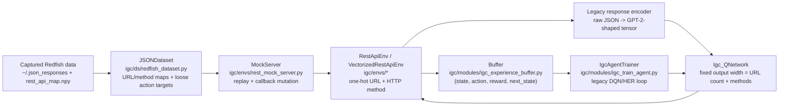
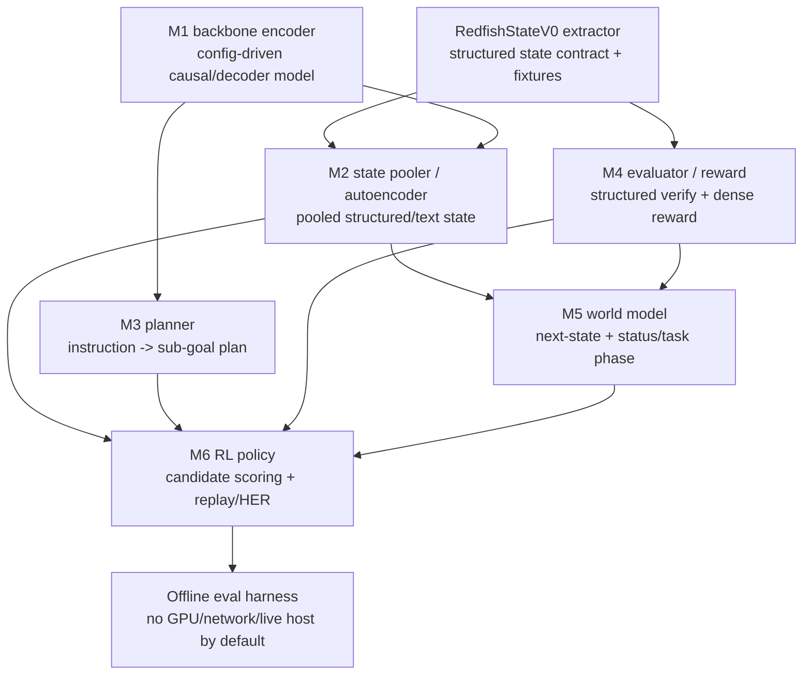

# IGC architecture & generalization plan

This document describes the target architecture for turning `igc` from a Redfish-specific
goal-conditioned RL project into a **generic, pluggable goal-conditioned tool-use agent
framework**, and the phased plan + training/MLOps roadmap to get there. Redfish becomes one
environment adapter among several (filesystem, SQL, GitHub), and the LLM backbone moves from GPT-2
to a config-driven large decoder model fine-tuned on the GB300 NVL72 cluster.

The end goal is not one Redfish policy but a **transferable, multi-step meta-learner**: an agent that
extracts a high-level goal, decomposes it into sub-goals, *discovers* the action space of whatever
REST API (or other tool backend) it is plugged into, finds an optimal strategy to reach the goal, and
carries that capability to new, unseen environments with little or no retraining.

> Status: working design. Diagrams are theme-aware SVGs under [`docs/diagrams/`](diagrams/).

---

## 0. Current reality, target interaction, and model map

The diagrams in this section are a design map. They intentionally separate the current Phase 0 code
path from the target architecture so planning work does not mistake scaffolding for an integrated
training path.

### Current Phase 0 code path

Today, the default Redfish path is still a captured-data, one-hot-action RL shell. The
`MockServer` class, defined in `igc/envs/rest_mock_server.py`, replays captured Redfish responses;
the Gym environments encode responses with the legacy GPT-2-shaped encoder path; and the RL trainer
still writes four-field replay tuples. Treat any DQN/HER metric as a smoke/debug signal until the
transition, terminal-mask, and evaluator contracts are fixed.

### Target interaction model

The target path keeps Redfish as one adapter, but moves the decision boundary to structured
observations, legal candidate actions, domain evaluators, and guarded execution. `RedfishStateV0` is
the proposed first compact-state schema: a JSON-serializable structured payload under
`Observation.structured`, not a learned graph model yet.

```mermaid
flowchart LR
    Goal["Goal\nigc/core/types.py\ninstruction + spec + constraints + plan"]
    Planner["Planner / casting layer\nplanned M3"]
    State["RedfishStateV0\nstructured resources, links,\nstatus, tasks, settings, telemetry"]
    Catalog["ToolCatalog.available_actions(obs)\nplanned Redfish adapter\nlegal ToolAction candidates"]
    Codec["ActionCodec\nigc/modules/policy/action_codec.py\nrender + cache candidate templates"]
    Pointer["Pointer Q head\nigc/modules/policy/pointer_policy.py\nscore legal candidates only"]
    Args["Argument stage\nigc/modules/policy/argument_decoder.py\nfills per-slot enum values"]
    Guard["Guardrail\nplanned dry-run -> approval -> executor"]
    Sim["Simulator\nMockServer adapter first\nlive Redfish gated"]
    Eval["Evaluator.verify(goal, obs)\nplanned domain reward + success"]
    Step["StepResult / Transition\nigc/core/types.py\nthin step + rich replay record"]
    Replay["Replay / HER\nterminal masks + achieved_goal"]

    Goal --> Planner --> Catalog
    State --> Catalog --> Codec --> Pointer --> Args --> Guard --> Sim
    Sim --> State
    State --> Eval --> Step --> Replay --> Pointer
    Goal --> Eval
```

### Model dependency map

The model stack is a dependency graph, not six independent training jobs. The backbone has to be
made config-driven before downstream heads can be trusted; the RL policy should not report real
learning metrics until structured state, legal actions, evaluator rewards, and replay masks are in
place. The math gate for these claims lives in [MATH_CHECKS.md](MATH_CHECKS.md).

### RedfishStateV0 field budget

`RedfishStateV0` is the smallest useful structured state target to validate before any learned graph
pooling. It should be deterministic, JSON-serializable, and testable from tiny synthetic Redfish
fixtures.

| Field group | Minimum content | Why it stays |
| --- | --- | --- |
| Resource identity | canonical URI, `@odata.type`, schema version, collection membership | preserves stable entities |
| Topology | selected `@odata.id` links, parent/subordinate edges | keeps Redfish's hypermedia graph visible |
| Health/control | `Status.State`, `Status.Health`, power/boot/firmware/storage summaries | carries control-relevant state |
| Action surface | allowed methods, `Actions`, targets, argument schemas, allowable values, risk level | builds legal `ToolAction` candidates |
| Deferred state | current vs pending settings, task/job phase, reboot/apply-time hints | prevents false Markov collapse |
| Observation metadata | HTTP status, error class, freshness/staleness, ETag when present | separates unknown, stale, and failed reads |
| Goal context | goal spec fragment, sub-goal index, achieved-goal fields, previous action/result | supports evaluator rewards and HER |

Validation comes before pooling: extractor golden tests, action-catalog parity, pending-settings
counterexamples, component-order invariance, and replay/HER shape tests.

## 1. Where igc is today, and the five target layers

`igc` already has a Redfish-specific MDP shell (Gym env + mock REST server + GPT-2-shaped state
encoder + legacy goal-conditioned DQN/HER trainer), but every layer is welded to Redfish and GPT-2.
The legacy trainer is useful for smoke/debug work, not for trusted RL metrics yet. The target is five
clean layers behind one interface. The map below marks each layer **refactor existing** (reuse what is
there) vs **build new** (greenfield), and calls out the keystone change.

- **Goal** — `Goal(instruction, spec, constraints, plan)`. Today only a `GoalTypeState`
  enum + a loose `self.goals` dict. *Build new.*
- **Environment** — a `GoalEnvironment` interface (`reset / available_actions / step / verify`) with
  Redfish as one adapter. The `MockServer` simulator + gym shell are reusable. *Refactor.*
- **Trajectory** — typed `Observation / ToolAction / Transition` + a recorder. Only `MockResponse`
  exists; transitions are currently discarded. *Build new.*
- **Learning & eval** — evaluators, preference data, reward model. SFT/RL trainers exist; evaluators
  and preference data are greenfield. *Build new.*
- **Runtime guardrail** — dry-run → approval → executor. Today a single `_is_live` boolean. *Refactor.*

**Keystone:** replace the one-hot `Box(num_urls + 6)` action with
`ToolAction(tool_name, op, arguments, target, risk_level)`. The env action space, the `JSONDataset`
adler32 codec, the Q-network head, and the goal extractor all depend on it — so it is migrated
**coexistence-then-cutover** behind an `action_repr ∈ {onehot, tool}` flag and a golden parity test
that pins slice order before any default flips.

### Scalable action selection — the pointer / candidate-scoring policy

The one-hot action space explodes because the policy's output width equals the number of discovered
URLs (`num_actions`), and adding methods/arguments multiplies it. The target fix is a **pointer /
candidate-scoring policy**: instead of a fixed `Linear(hidden, num_actions)` head, the policy scores
the *legal* candidate actions that a Redfish `ToolCatalog.available_actions(obs)` adapter will return
for the current state. The pointer head and action codec are scaffolded; the Redfish adapter and env
cutover are still planned.

- The policy encodes state + goal into a query `q`; each candidate `ToolAction` is rendered to a
  canonical, value-independent string (`igc/core/action_render.py`, landed) and embedded into a key
  `k_i` by the shared backbone (cached by `action_template_key`). The score is `Q(s, a_i) = q · k_i`,
  so the output width = number of *currently legal* candidates (local fan-out, tens) — **never the
  global catalog**.
- Adding tools/URLs/methods grows (cached) encoding compute, not policy weights. A brand-new tool is
  intended to be scorable in the same embedding space — no output-layer resize, no adler32 re-index,
  no head retrain — but transfer remains an evaluation target until the offline harness proves it.
- Arguments are filled in a second stage from `ToolSpec.arg_schema` (small categorical heads for
  enumerated/bounded slots; constrained backbone decoding for freeform path/SQL/body), then
  `ToolCatalog.validate` gates execution.
- The large LLM is the shared encoder for state, candidate-action text, and freeform-argument
  generation (LoRA + bf16); only tiny heads (state-query, action-projector, argument-decoder) train.
- Migration: `--action_repr {onehot, pointer}` (default `onehot`); the legacy `Igc_QNetwork` + adler32
  codec stay byte-for-byte intact until a parity test (pointer ≡ one-hot on the enumerated Redfish
  case) is green, then the default flips.

Target state encoding uses the same backbone (pooled last-hidden of `Observation.text` plus
`Goal.instruction`) with dims derived from `config.hidden_size`, not hardcoded `1025` / `768`. The
current environment path still encodes raw JSON responses into legacy tensors, so `RedfishStateV0`
and state-pooler work must land before this becomes the training path.

## 2. How a new simulator plugs into the agent

The target framework uses **typed Protocols + a decorator registry + per-env plugin packages**. The
core should not change when a new environment is added; the existing `MockServer.request → MockResponse`
seam is kept intact behind a planned `RedfishSimulator` adapter.

Implemented today in Phase 0: `igc/core/types.py` defines the core dataclasses and enums, and
`igc/core/protocols.py` defines the runtime-checkable Protocols. Still planned: `igc/envs/registry.py`,
`make(...)` / `make_vec(...)`, per-env plugin packages under `igc/envs/<name>/`, and the Redfish adapter
that preserves the mock-server seam.

**Target recipe to add a new simulator (touches no core file once the registry lands):**

1. Copy `igc/envs/_template/` → `igc/envs/<name>/`.
2. Implement the `Simulator` (`execute(target, op, args)→SimResult`, plus `snapshot`/`restore`).
3. Declare the `ToolCatalog` — `ToolSpec`s with per-op arg schema + `RiskLevel` (sizes the head, feeds
   the guardrail).
4. Implement `Evaluator.verify(goal, obs)→(reached, dense_reward)` with domain-correct success.
5. Add a `Recorder` (cassette) for record/replay, or `NullRecorder` for self-simulating envs.
6. `@register("<name>")` a manifest in `__init__.py`.
7. Add an offline pytest (build, codec round-trip, scripted episode reaches goal, destructive action
   blocked without an approval token) on a `StubEncoder` — no GPU.

### The four environments

| Env | Why it is in the mix | What it proves |
| --- | --- | --- |
| Redfish | the real target domain | live infrastructure control (the actual goal) |
| Filesystem | cheapest offline env with real destructive actions | `ToolAction.arguments`, dynamic `available_actions`, destructive risk for the gate |
| SQL (SQLite) | self-simulating, exact verification | exact `verify()` + `BEGIN/ROLLBACK` as the dry-run guardrail primitive |
| GitHub | a real third-party REST API via record/replay | the capture→simulate→live story generalizes; multi-step planning |

## 3. Workloads are hierarchical: planning, preconditions, discovery

A workload like *"tune BIOS, then boot Ubuntu"* is not one action — it decomposes into ordered
sub-goals with hard preconditions (on iDRAC, a BIOS change is staged as a pending `@Redfish.Settings`
object, applied only after a config **job** and a **reboot**). The terminal reward is clear but
sparse, so the agent must *plan*, and it must *discover* both the API (action space) and the state
machine (Current→Pending→Applied, job Scheduled→Running→Done).

Design consequences: `Goal` carries a `plan` (sub-goal DAG); `ToolAction` carries `preconditions`
and `effects`; the simulator models deferred/async state; reward is decomposed (terminal +
per-sub-goal + progress shaping) with HER over reachable sub-goals; the planner ("casting" layer)
generalizes `GoalExtractorTrainer` from one action to an ordered plan; and API/state discovery become
explicit pipeline stages.

### Meta-learning: a transferable multi-step agent

The end goal is not a single Redfish policy but an agent that **transfers** — plug it into a new REST
API (or filesystem/SQL/GitHub) and it should operate that backend with little or no retraining. This
is the target hypothesis; it becomes a claim only after offline eval traces and metrics support it.
The design makes the hypothesis concrete, layer by layer:

1. **Extract the goal.** The planner (the "casting" layer) maps a high-level instruction to a `Goal`
   and an ordered sub-goal `plan` (the hierarchical decomposition above).
2. **Discover the action space.** A new backend exposes its tools/ops through `ToolCatalog` +
   `available_actions(obs)` (for Redfish, derived from the `idrac_ctl` crawl + the `.npy` map). The
   agent never needs a fixed, pre-enumerated action set — it reads what is legal *now*.
3. **Act zero/few-shot.** Because the policy is the **pointer / candidate-scoring** head (§1), a tool
   it has never seen is still scorable: its `tool_name/op/schema` text is embedded by the shared
   backbone, so there is no output-layer resize, no re-index, no head retrain. This is what turns "a
   new API" from a retraining event into an inference-time lookup.
4. **Find an optimal strategy.** Goal-conditioned RL (DQN + HER) over the sub-goal plan learns the
   ordering and the fewest-steps path; the world model supplies preconditions/dynamics so the agent
   plans rather than flails.
5. **Adapt on the new environment.** Trained across *multiple* environments (filesystem, SQL, GitHub,
   Redfish) — the meta-training distribution — the shared backbone, pointer policy, and state encoder
   transfer; a short interaction (plus an optional LoRA / world-model update) adapts to the new
   backend's quirks. This is the meta-learning ("learn to learn") payoff: capability acquired on known
   APIs carries to unknown ones.

In short: **extract → plan → discover → execute → transfer.** Every layer is built so the unit of
generalization is *the skill of operating a tool API*, not *a specific API*.

## 4. The six models and the training curriculum

`igc` is not one model — it is six, with real dependencies. `M1` (the backbone) is the single root
and the riskiest node: if hidden size `H` changes, every downstream magic dim breaks, so dims are
de-hardcoded before the first backbone fit.

| Stage | Model | Objective | Key metric | Compute |
| --- | --- | --- | --- | --- |
| 0 | — | make it runnable + de-hardcode dims + backbone config-driven | `pytest -q` green, ruff clean | CPU |
| 1 | M1 backbone / state encoder | causal-LM SFT over Redfish JSON → checkpoint A | held-out token acc ↑ vs measured GPT-2 baseline | 1-GPU |
| 2 | M2 autoencoder · M3 planner · M4 reward | pool→latent 64 · NL→sub-goal DAG · decomposed reward | recon MSE · DAG topo-validity · reward AUC | 1-GPU ×3 |
| 3 | M5 world/transition | next-latent + status/job-phase classification | 1-step error, phase accuracy, rollout drift | 1-GPU |
| 4 | M6 RL agent | goal-cond. DQN + HER on `ToolAction`, learned reward | success_rate per workload, episode_length | 1-GPU (longest) |

## 5. Backbone modernization (GPT-2 → flash-class LLM)

The target loader should use `AutoTokenizer` + a class arg, and `ValueHead` should read
`config.hidden_size`, so the model becomes backbone-agnostic. The welds to remove:

- **Kill `.transformer`/`.wpe` reads** → a `backbone_utils.py` helper (`base_model_prefix`,
  `config.hidden_size`, `max_position_embeddings`). RoPE models have no positional table, so
  `emb_shape` must be `(seq_len, hidden_size)`, never a weight tensor.
- **Replace the conv1d `AutoStateEncoder`** (`nn.Linear(1026,…)` + a `seq_len*H` decoder head — a
  ~4M-wide memory bomb at H=4096) with a masked-mean/last-token `StatePooler` + MLP that reconstructs
  the *pooled* vector.
- **Config-driven `--model_type`** (drop gpt2-only choices), `--pooler`, `--use_peft`, `--precision`.
- **LoRA → PEFT.** The existing `lora1d.py` wrapper is GPT-2-only and crashes on construction today;
  adopt HF PEFT targeting `q_proj/k_proj/v_proj/o_proj/gate_proj/up_proj/down_proj`.
- **Policy:** LoRA + bf16 + gradient checkpointing on a single GB300 first; full FT only for a tiny
  validation model; fp8/NVFP4 opt-in after bf16 is green.
- **Flash as teacher only** (offline synthetic plan/trajectory generation, sequence-level
  distillation, eval judge) — never fine-tuned, never in the training loop, never near a BMC.
- **Small-model-first:** validate the whole refactor against a tiny CausalLM on CPU before the cluster.

## 6. Phased roadmap

| Phase | Goal | Gate |
| --- | --- | --- |
| 0 · Stabilize | fix launch blockers + de-hardcode dims + backbone config-driven | offline `pytest -q` + ruff |
| 1 · Core types | `igc/core/` contracts + Protocols; `Goal.plan`; Buffer → 5-tuple (done flag) | round-trip/type tests |
| 2 · Registry + Redfish adapter | `register/make`; Redfish plugin; `action_repr` flag + parity test; route `igc_rl_module` through `make_vec` | parity test green (one-hot ≡ tool for GET/HEAD) |
| 3 · Offline prover envs | filesystem + sqlite plugins (real args, dynamic actions, exact verify, dry-run, destructive blocked) | per-env offline tests |
| 4 · Trajectory + github | recorder + `TrajectoryDataset`; `CassetteSimulator`; github plugin (offline replay, live-gated) | record→load round-trip; github offline via cassette |
| 5 · Backbone + M1/M2 | backbone-agnostic refactor; `StatePooler`; train M1 + M2 on NVL72 | small-model CPU green → 1-GPU overfit-a-batch smoke |
| 6 · Learning layer | planner (M3) + reward (M4) + world model (M5) + evaluators + preference data → RL agent (M6) | offline eval harness scores traces; GPU-marked training |
| 7 · Guardrail + deploy | dry-run/approval/executor over `_is_live`; serve backbone+planner via vLLM (TP=1); live Redfish canary behind the gate | guardrail blocks destructive-without-approval; offline gate stays green |

## 7. Infra · monitoring · deploy (NVL72)

The canonical runtime setup lives in [ENVIRONMENT.md](ENVIRONMENT.md). Architecturally, training stays
separate from local development: Phase 0 gates on CPU, while training/fine-tuning runs on the GB300
NVL72 through a one-GPU-first Slurm/pyxis workflow.

- **Monitoring** reuses the existing `MetricLogger` (`--metric_report` tb/wandb/mlflow): per-model
  curves (loss/perplexity/accuracy/grad-norm/tokens-per-sec; reward/success-rate/episode-length for
  M6).
- **Training-loop sanity checks:** overfit-a-batch, grad-norm clip + `isfinite` guard, LR
  warmup/cosine, deterministic seed, resume-from-checkpoint, early stop, a startup dim-contract
  assertion (`observation_space == latent_dim + goal_dim`), and a Buffer arity check.
- **Deploy, two paths:** (A) backbone + planner served OpenAI-compatible via vLLM, **TP=1 mandatory**
  (blocked until the backbone refactor lands); (B) the RL policy runs in the mock-env eval harness,
  never wired to a live BMC by default. Any real-Redfish move is read-only GET/HEAD first, paced,
  approved non-prod host, behind the guardrail.

## 8. Verified defects to clear in Phase 0

Found in-tree during design review:

- `igc/shared/shared_arg_parser.py` currently defines `--json_data_dir`, while
  `igc/modules/igc_rl_module.py` references missing `spec.raw_data_dir`; Phase 0 must alias or rename
  one side.
- `lora1d` wrapper crashes on construction.
- `load_checkpoint` uses a bare `raise`, which breaks resume handling.
- `rl_batch_size` is typed as a float.
- Stale shell scripts still point at a nonexistent `trainer.py`.
- `train_rl_agent.py` has a tuple-unpack bug.
- ~~Buffer entries are 4-tuples with no `done` flag.~~ **Fixed:** `igc/modules/igc_experience_buffer.py`
  now stores/returns a per-transition `done`; the trainer's target uses
  `igc.modules.rl.q_targets.q_learning_target` with a `(1 - done)` mask.
- Magic dimensions such as `1026`, `1025`, and `seq*768` are still hard-coupled to GPT-2 shapes.

## 9. Open decisions

1. Trainable base model id (the `--model_type` value for the flash-class backbone).
2. Planner build — learned (`GoalExtractor`→planner), LLM-via-Flash, or both.
3. `--raw_data_dir` — new flag or alias of the existing `--json_data_dir`.
4. Reward decomposition — how per-sub-goal rewards sum-consistently with the terminal reward.

### Resolved design decisions (review "hard flags")

1. **`Transition` vs `StepResult`** — both, distinct roles (`igc/core/types.py`).
   `GoalEnvironment.step()` returns the thin Gymnasium `StepResult`
   (`observation, reward, terminated, truncated, info`); `Transition` is the rich
   replay-buffer record adding `action, next_observation, desired_goal,
   achieved_goal` plus a `relabel()` helper. The env stays goal-agnostic; the agent
   assembles a `Transition` before pushing to replay.
2. **terminal vs truncated semantics** — Gymnasium semantics. `terminated` is a true
   MDP terminal (goal reached / unrecoverable) → bootstrapping stops (target =
   reward). `truncated` is a budget/time cut → bootstrapping continues. The DQN mask
   is `(1 - terminated)` only; a transition is terminal iff the env goal was reached.
3. **legal-action source of truth** — merged catalog. The `.npy`
   `allowed_methods_mapping` is authoritative for *verb legality* per URL (the binding
   `idrac_ctl` contract); the JSON `Actions` / `@Redfish.ActionInfo` blocks supply the
   *parameter space* (enums) consumed by the stage-2 argument decoder. CSDL schema is a
   later enrichment.
4. **credential logging** — redacted before any live canary
   (`MockServer._redact_headers`; no username/password/token in request logs).
5. **two-stage action with values** — `action_to_prompt` intentionally drops argument
   values, so mutating actions are completed by `igc/modules/policy/argument_decoder.py`
   (per-slot enum scoring, no cross-product explosion).

## 10. Meta-RL direction (agreed 2026-06-30)

**Final goal (Tier 4):** a generalist RL agent that operates ANY REST API — given a goal it
*discovers* the API's action space, plans the call sequence to reach it, and **generalizes to an
unseen API**, adapting from a few examples (meta-learning). Redfish is the first proving ground because
we can simulate it; the recipe (build a simulator → train) repeats per API. Tiers: 1 = Redfish loop
works; 2 = generalization + ablations + safety (research result); 4 = several simulators → generalize to
an unseen REST API. Tier 3 (filesystem/SQL) folds in as diverse sims that force generalization.

**It is a sparse-reward problem.** Reward arrives only at goal completion of a multi-step API
interaction, so three complementary attacks: **HER** (relabel achieved states — `q_targets.relabel_future`
+ `Transition.achieved_goal`), **LLM priors + meta-learning** (smart exploration), and **action-space
discovery + the pointer policy** (score only discovered legal candidates → shrink the search).

**Architecture — RL² cast as a Transformer.** The LLM backbone carries cross-episode history in its
context = the in-context meta-learner (the Transformer analog of RL²'s RNN; cf. Decision Transformer /
Algorithm Distillation). M1/M2 compress observations so a long history fits the context budget. **Dense
first; MoE is a later upgrade** (upcycle/distill once there are many APIs + data + expert-parallel infra)
— MoE adds capacity/specialization, not the meta-learning (which lives in attention-over-history).

**Backbone sizing — decoupled.** Small dense bf16 backbone for the hot-loop encoder/RL (M1/M2/M6,
runs every step); a larger 14–32B for the goal extractor (M3, runs once per episode). Trainable =
small/mid dense bf16 + LoRA + ZeRO-3 (`--sharding zero3`). DeepSeek-V4-Flash (284B FP8/FP4 MoE) is the
**inference/teacher** only (deployed NVFP4), never the trainable backbone.

**M3 — Design B (standalone distillation).** Own backbone + tokenizer + DeepSeek-distilled
`(instruction → goal + params)` data, reusing the existing `GoalExtractorTrainer`; bootstrap by calling
DeepSeek directly. Verify teacher outputs against `Goal.spec` before distilling.

**Training curriculum.**
1. **Represent** (supervised, separate): M1 backbone SFT + M2 autoencoder → compact states. Pretrained
   first; RL LoRA-adapts on top (do not co-train the whole backbone with RL).
2. **Plan** (distill) + **Reward** (build, parallel): M3 from DeepSeek; M4 schema-driven verifier.
3. **Meta-RL — ONE optimization path:** the in-context RL²-Transformer policy over the API-sim
   distribution, with HER, a **BC/SFT warm-start** (imitate teacher demos before RL — the main lever
   against the sparse-reward cold start), and a **narrow→broad task curriculum**. Meta is not a phase
   after single-task RL; it *is* RL over a task distribution with cross-episode memory.
4. **Scale** (later): MoE via upcycle/distillation.

**Eval (the contribution):** on a held-out API, *success vs. number of adaptation examples* — the
few-shot adaptation curve.
