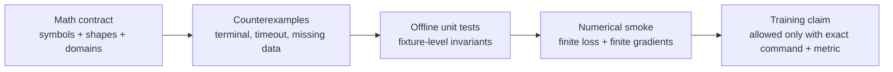

# Math checks and optimization gate

This document is the math gate for `igc`. It records the equations, tensor contracts, and numerical
checks that must be true before a training curve, RL metric, or optimization result is treated as
evidence. It is deliberately smaller than the full architecture: the job here is to reject bad minima
and invalid objectives early.

## Status

Current status: **REVISE**.

The direction is sound: move from raw JSON text embeddings and one-hot URL/method actions toward a
structured Redfish state, legal `ToolAction` candidates, evaluator rewards, and replay-ready
transitions. The current DQN/HER path is not yet a trustworthy learning baseline.

Do not report the legacy RL trainer as solving a workload until the checks below are green.

## Current blockers

| Area | Current issue | Required checkout |
| --- | --- | --- |
| Replay tuple | `igc/modules/igc_experience_buffer.py` stores `(state, action, reward, next_state)` only. | Replay must carry `terminated`, `truncated`, desired goal, achieved goal, and enough action metadata to recompute targets. |
| Bellman target | `igc/modules/igc_train_agent.py` bootstraps from every sampled next state and clips targets with an upper bound of `0`. | Terminal transitions must not bootstrap; success targets must remain positive when reward is positive. |
| HER relabeling | Relabeling uses the final pre-action state, not a future achieved next state. | Relabeled goals must come from future achieved observations or an evaluator-produced `achieved_goal`. |
| Done semantics | Success, timeout, 4xx, and 5xx currently mix `done`, `terminated`, and `truncated`. | Define a single terminal/truncated table and test every branch. |
| Goal reward | Current checks use tensor equality or `allclose` over embeddings. | `Evaluator.verify(goal, obs)` must compute success and dense reward over structured state. |
| Legal actions | Current envs expose continuous one-hot `Box(num_urls + methods)`. | `ToolCatalog.available_actions(obs)` must mask illegal actions before selection. |
| Argument values | `igc/core/action_render.py` intentionally renders action templates without concrete values. | A second-stage argument/effect path must distinguish value choices before mutating actions are trusted. |

## Math contract

### Transition and replay record

The replay record used for RL and HER should contain at least:

```text
(obs_t, action_t, reward_t, obs_tp1, terminated_t, truncated_t,
 desired_goal_t, achieved_goal_tp1, info_t)
```

The env step result may be a smaller runtime object, but replay cannot lose the fields needed to
recompute targets and relabel rewards.

### Bellman target

For a DQN-style update, the target must be:

```text
y_t = r_t + gamma * (1 - terminal_t) * max_a' Q_target(s_{t+1}, a')
```

where:

- `terminal_t` is true for task completion or unrecoverable failure.
- `truncated_t` is a time/resource cutoff and should be handled explicitly, not silently treated as
  either success or failure.
- The clipping range, if any, must not remove positive success rewards.

Minimum checkout: a one-state terminal success fixture must produce target `+1` when `reward_t = 1`
and `terminal_t = true`.

### HER relabeling

For hindsight experience replay, the relabeled goal must be a future achieved goal:

```text
g' in {achieved_goal_{t+1}, ..., achieved_goal_T}
r'_t = Evaluator.reward(obs_{t+1}, g')
```

Invalid checkout: using `obs_t` or the final pre-action state as `g'` without proving it is an
achieved goal.

### Candidate-action scoring

The pointer policy scores only legal candidates:

```text
q = f_state(obs, goal)
k_i = f_action(candidate_i)
Q(obs, candidate_i) = q dot k_i
```

The candidate list must come from `ToolCatalog.available_actions(obs)`. Padding is masked to
`-inf`. The score chooses an action template; concrete argument values require a separate checked
stage before execution.

### State compression

The first compact state target is `RedfishStateV0`, a JSON-serializable structured payload under
`Observation.structured`. Learned graph pooling, bottlenecks, or latent compression wait until
these invariants are fixture-tested:

- two observations that differ only in pending settings or task phase must not collapse;
- collection order changes must not change the state;
- one unhealthy or missing component must change the state;
- failed, stale, unknown, and fresh observations must be distinguishable;
- legal action masks must be reproducible from the state.

## Optimization checks

Every trainable objective gets this checkout before longer runs:

1. **Shape proof:** list input/output tensor shapes and assert them in a small test.
2. **Boundary cases:** empty candidates, one candidate, terminal transition, timeout transition,
   invalid method, missing telemetry, and NaN/Inf inputs.
3. **Finite loss:** loss is finite for a tiny deterministic batch.
4. **Finite gradients:** all trainable parameters have finite gradients after one backward pass.
5. **Overfit smoke:** a tiny fixture can overfit or reduce loss in a bounded number of steps.
6. **Metric meaning:** the metric must correspond to the objective being optimized.



## Model-specific checkout table

| Stage | Objective | Required math checkout |
| --- | --- | --- |
| M1 backbone | language-model loss over Redfish text | tokenization mask, loss finite, small batch overfit, no hidden-size assumptions. |
| M2 state pooler | pooled state reconstruction or auxiliary prediction | shape contract, no `seq_len * hidden_size` decoder blowup, finite gradients. |
| M3 planner | instruction to sub-goal plan | plan validity metric, topological order, precondition satisfaction. |
| M4 evaluator/reward | structured success and dense reward | reward table for success/failure/progress/no-op; no embedding equality as final verifier. |
| M5 world model | next state/status/task phase | one-step prediction target, terminal-state handling, rollout drift metric. |
| M6 RL policy | candidate-action Q-learning with HER | terminal mask, legal-action mask, HER achieved-goal relabel, target sanity. |

## Local tool policy

Default math checks must run offline in the CPU `igc-dev` environment from `environment-dev.yaml`.
Use:

```bash
KMP_DUPLICATE_LIB_OK=TRUE \
OMP_NUM_THREADS=1 \
TRANSFORMERS_OFFLINE=1 \
HF_DATASETS_OFFLINE=1 \
conda run -n igc-dev python -m pytest -q <math/test node ids>
```

Allowed local tools:

- Python standard library for exact fixtures and shape checks.
- NumPy, SciPy, SymPy, scikit-learn, and PyTorch in `igc-dev`.
- MATLAB, Octave, or Wolfram tools only when installed and activated locally; they are optional and
  must not be required by the default gate.

Network, GPU, live Redfish hosts, private endpoints, and captured payloads are not required for this
math gate.

## Next math tests to queue

1. Replay stores and samples `terminated`/`truncated` masks.
2. Bellman terminal-success target remains positive and does not bootstrap.
3. HER relabeling uses future `achieved_goal` and recomputes evaluator reward.
4. Vector env keeps per-env terminal/truncated state without shrinking batch observations.
5. `ToolCatalog.available_actions(obs)` masks illegal methods before selection.
6. `RedfishStateV0` extractor distinguishes pending settings/task phase from already-applied state.
7. Candidate scoring handles empty, one, and padded candidate sets.
8. One-step optimizer smoke verifies finite loss and gradients on the smallest deterministic batch.

## Claim rule

A math or optimization claim is acceptable only when it includes one of:

- a proof sketch that states assumptions and boundary cases;
- a deterministic counterexample showing what fails;
- exact offline command output from a small numerical check;
- an explicit blocker explaining the missing tool, fixture, or decision.

If none of those exist, the correct status is:

```text
BLOCKED: missing math evidence
```
