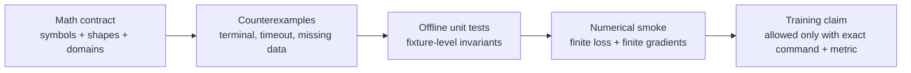

# Math checks and optimization gate

This document is the math gate for `igc`. It records the numerical checks that must be true before a
training curve, an eval metric, or an optimization result is treated as evidence. It is deliberately
small: the job is to reject bad minima and invalid objectives early.

The machine-readable schema files under `configs/contracts/` (checked into the repo) are the
authoritative definition of every record shape named here. Examples in this document are
illustrative only.

## Per-objective checkout

Every trainable objective gets this checkout before longer runs:

1. **Shape proof:** list input/output tensor shapes and assert them in a small test.
2. **Boundary cases:** empty input, single-element input, terminal transition, timeout transition,
   invalid method, missing telemetry, and NaN/Inf inputs.
3. **Finite loss:** loss is finite for a tiny deterministic batch.
4. **Finite gradients:** all trainable parameters have finite gradients after one backward pass.
5. **Overfit smoke:** a tiny fixture can overfit or reduce loss in a bounded number of steps.
6. **Metric meaning:** the metric must correspond to the objective being optimized.



## Stage-specific checkout table

| Stage | Objective | Required math checkout |
| --- | --- | --- |
| Phase 1 fine-tune → `model_x` (the Phase 1 fine-tuned backbone checkpoint) | language-model loss over Redfish JSON | tokenization mask, loss finite, small-batch overfit, no hidden-size assumptions. |
| Phase 2 extraction (unordered `rest_api_list`) | cross entropy over one canonical serialization; correctness is set match | set-match metric is order-invariant; empty-list hard negatives score correctly; k=1 rows stay lists of length one. |
| Phase 3 extraction (unordered `calls`) | method + argument binding per selected API | method accuracy, argument JSON validity, `{}` accepted for reads, unordered set match over calls. |
| `z_rest` encoder (Phase 2 REST-set latent) | REST-set representation | collapse checks, retrieval sanity; SEPARATE from `z_method`; exact argument values stay raw, outside the latent. |
| `z_method` encoder (Phase 3 method latent) | method representation | collapse checks; SEPARATE from `z_rest`; exact argument values stay raw, outside the latent. |
| RL policy (separate stage) | Q-learning with HER over execution | terminal mask, legal-action mask, HER future achieved-goal relabel, target sanity (below). |

There is no shared latent, unified encoder, or zero-shot-universal claim in v1. There is no planner,
scheduler, or curriculum inside Phase 2/3: ordering, prerequisites, retries, waiting, recovery,
hidden state, and error handling are learned only by the separate RL policy stage.

## Contract shapes to test against

These generic examples show the shapes the checks must hold for. The schema files under
`configs/contracts/` are authoritative; Redfish-shaped data appears only as the current test
environment.

Phase 2 output is always `rest_api_list: list[str]`, unordered. One item is still a list of
length one — never a scalar or a scalar/list union.

```text
k=1  "set x to 1"                        -> {"rest_api_list": ["/v1/x"]}
k=2  "set x to 1 and read z"             -> {"rest_api_list": ["/v1/x", "/v1/z"]}
k=3  "set x to 1, set y to 2, and read z"-> {"rest_api_list": ["/v1/x", "/v1/y", "/v1/z"]}
```

Phase 3 output is always `calls: list[Call]`, unordered, each call carrying an explicit
`http_method` and an `arguments` object (`{}` for reads). One call is still a list of length one.

```json
[
  {"rest_api": "/v1/x", "http_method": "PATCH", "arguments": {"x": 1}},
  {"rest_api": "/v1/y", "http_method": "PATCH", "arguments": {"y": 2}},
  {"rest_api": "/v1/z", "http_method": "GET",   "arguments": {}}
]
```

Order-invariance check: `["/v1/b", "/v1/a"]` must score equal to canonical `["/v1/a", "/v1/b"]`,
and the same for permuted `calls`. Ordering is never a Phase 2/3 target; when a row carries expert
ordering it lives in the separate `expert_call_order` field (RL-oracle evidence recorded by the
dataset builder) and is consumed only by the RL stage.

## RL policy checks (separate stage)

The replay record used by the RL stage must carry at least:

```text
(obs_t, action_t, reward_t, obs_tp1, terminated_t, truncated_t,
 desired_goal_t, achieved_goal_tp1, info_t)
```

The env step result may be a smaller runtime object, but replay cannot lose the fields needed to
recompute targets and relabel rewards.

**Bellman target.** For a DQN-style update:

```text
y_t = r_t + gamma * (1 - terminal_t) * max_a' Q_target(s_{t+1}, a')
```

- `terminal_t` is true for task completion or unrecoverable failure.
- `truncated_t` is a time/resource cutoff and is handled explicitly, never silently treated as
  success or failure.
- Any clipping range must not remove positive success rewards.
- Minimum checkout: a one-state terminal success fixture must produce target `+1` when
  `reward_t = 1` and `terminal_t = true`, with no bootstrap from the terminal next state.

**HER relabeling.** The relabeled goal must be a future achieved goal:

```text
g' in {achieved_goal_{t+1}, ..., achieved_goal_T}
r'_t = Evaluator.reward(obs_{t+1}, g')
```

Invalid checkout: using `obs_t` or the final pre-action state as `g'` without proving it is an
achieved goal.

## Local tool policy

Default math checks must run offline in the CPU `igc-dev` environment from `environment-dev.yaml`.
Use:

```bash
KMP_DUPLICATE_LIB_OK=TRUE \
OMP_NUM_THREADS=1 \
TRANSFORMERS_OFFLINE=1 \
HF_DATASETS_OFFLINE=1 \
conda run -n igc-dev python -m pytest -q <math/test node ids>
```

Allowed local tools:

- Python standard library for exact fixtures and shape checks.
- NumPy, SciPy, SymPy, scikit-learn, and PyTorch in `igc-dev`.
- MATLAB, Octave, or Wolfram tools only when installed and activated locally; they are optional and
  must not be required by the default gate.

Network, GPU, live Redfish hosts, private endpoints, and captured payloads are not required for this
math gate.

## Claim rule

A math or optimization claim is acceptable only when it includes one of:

- a proof sketch that states assumptions and boundary cases;
- a deterministic counterexample showing what fails;
- exact offline command output from a small numerical check;
- an explicit blocker explaining the missing tool, fixture, or decision.

If none of those exist, the correct status is:

```text
BLOCKED: missing math evidence
```
