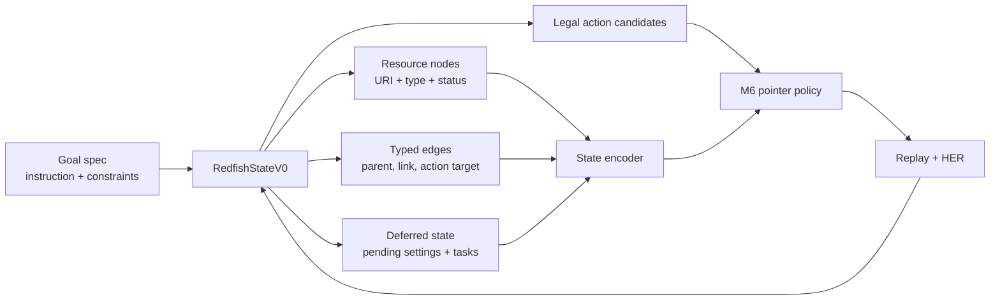

# State Graph Plan

`RedfishStateV0`, defined in [ARCHITECTURE.md](ARCHITECTURE.md), is the
compact structured state contract for the current RL path. This file records
where graph structure belongs in that state and how it should graduate from
explicit fields to learned graph features.

## Purpose

The RL agent needs a state that is small enough to train on, but rich enough to
remain Markov for infrastructure tasks. A flat JSON token stream hides
relationships such as chassis-to-manager links, pending settings, tasks, and
action targets. The state graph keeps those relationships explicit before any
learned pooling or GNN layer compresses them.

## Current Contract

Today the graph is a planned part of the structured state contract, not a
completed learned graph encoder. `RedfishStateV0` already reserves topology and
goal-context fields:

- **Resource nodes:** canonical URI, `@odata.type`, schema version, and
  collection membership.
- **Topology edges:** parent/child links, subordinate links, selected
  `@odata.id` references, and action target references.
- **Control state:** health, power, boot, firmware, storage, pending settings,
  tasks, and apply-time hints.
- **Goal context:** the active goal fragment, sub-goal index, achieved-goal
  fields, and previous action/result.

The D-002 action-candidate decision in [DECISIONS.md](DECISIONS.md) adds the
first graph feature surface for M6: each `(endpoint, method)` candidate should
carry both text features and graph features.

## State Graph Shape

## Planned Representation

1. **Extractor first:** build deterministic `RedfishStateV0` fixtures from small
   Redfish captures and synthetic resource graphs.
2. **Explicit graph features:** attach compact per-candidate features such as
   node depth, edge type, distance to goal resource, action target type, sibling
   count, and missing-link flags.
3. **Goal-conditioned pooling:** pool only the local neighborhood relevant to
   the active goal and legal actions, instead of encoding the full service tree
   every step.
4. **Learned graph neighborhood features:** defer GNN or graph-transformer
   pooling until explicit features beat the text-only baseline on held-out
   topology splits.

## Validation Gates

- Golden extractor tests for URI normalization, links outside `Links`, pending
  settings, and task state.
- Action-catalog parity tests between graph-derived candidates and the current
  one-hot/action list.
- Component-order invariance: shuffling collection order must not change graph
  features.
- Missing-edge sentinels: absent links are encoded as unknown, not as
  zero-valued real edges.
- HER compatibility: achieved-goal fields and future relabelled goals must map
  back to graph nodes.
- Retrieval checks: nearest-neighbor state embeddings should group related
  topology states without collapsing all healthy states together.

## Non-Goals

- Do not require a live Redfish crawl to test graph extraction.
- Do not replace the legacy one-hot action path until the action parity gate
  passes.
- Do not train a learned graph pooler until the explicit feature baseline and
  metric reports exist.
- Do not commit captured Redfish payloads, private hostnames, or local run artifacts.

## Open Questions

- Which edge types are mandatory for Markov sufficiency across BIOS, boot,
  firmware, storage, and task flows?
- How small can the local goal-conditioned subgraph be before action ranking
  loses topology context?
- Should graph pooling feed M1 state embeddings directly, or remain a
  candidate-action feature for M6 until the RL metrics are stable?
